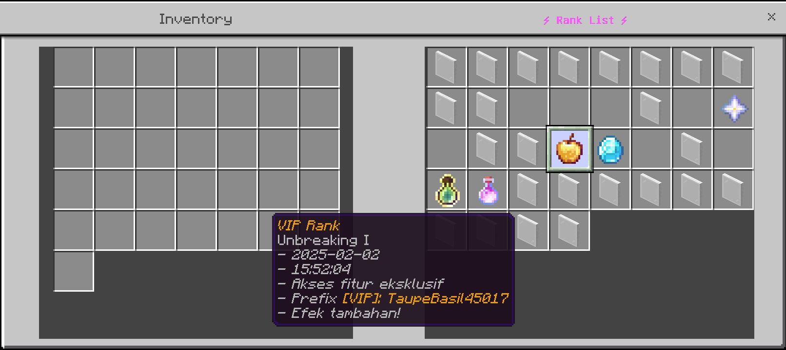
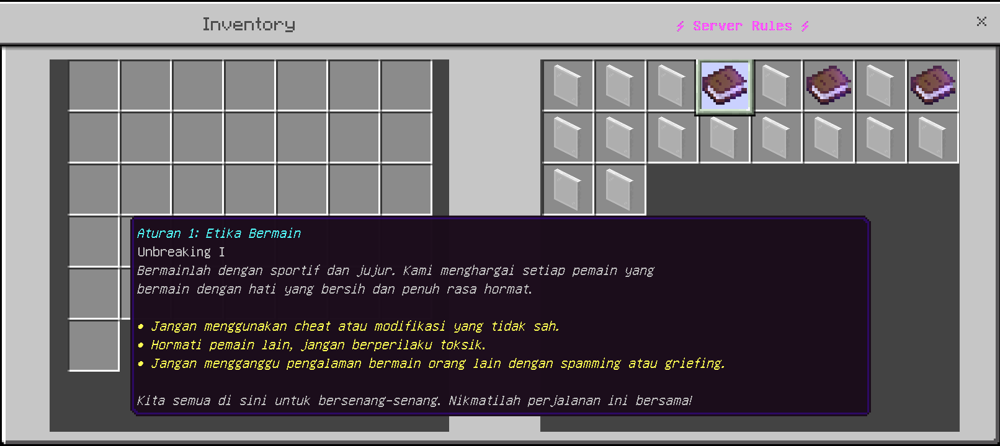

# RankGUI
RankGUI is a pocketmine plugin that provides rank and rules with gui

# Feature
- Sound open gui
- Gui decoration
- Can't pick up gui items
- Easy to setup
- Custom item gui
- Acak gui rank items (except rules)

# Placeholder
- Displaying player name {player}
- Display time zone {time}
- Displaying the date {date}

# Depend
- [InvMenu](https://github.com/Muqsit/InvMenu)
- [CustomSizedInvMenu](https://github.com/Muqsit/CustomSizedInvMenu)

# In Game
- Rank Menu

- Rules Menu

